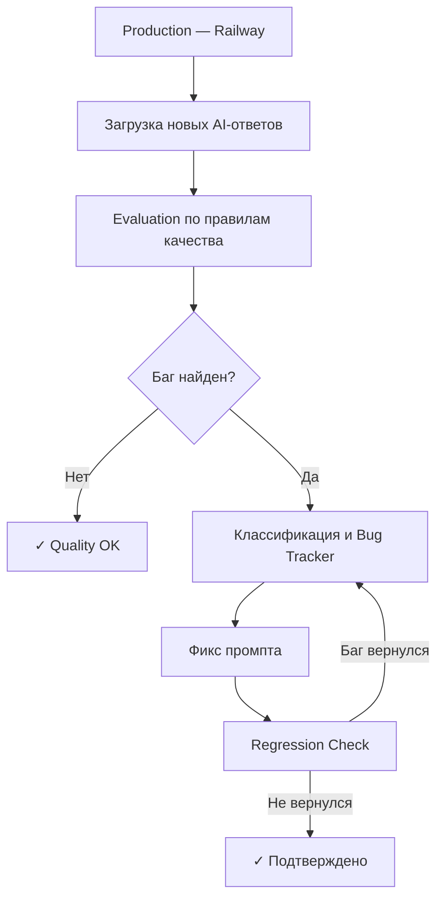
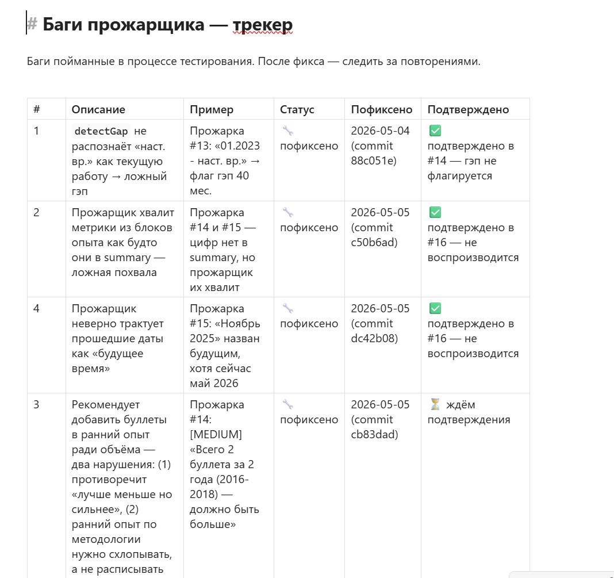

# AI Evaluation Pipeline — система оценки качества AI-ответов

Автоматизированная система для контроля качества AI-рекомендаций в production. Построена как часть инфраструктуры сервиса Resume Roaster.

---

## Проблема

При разработке AI-продукта основная сложность — не генерация ответов, а контроль их качества. Ручная проверка каждого AI-ответа не масштабируется: занимает время, не позволяет системно отслеживать повторяющиеся ошибки и не даёт ответа на вопрос «стало лучше или хуже после изменения промпта?»

---

## Решение

Автоматизированный pipeline для оценки качества AI-рекомендаций:

- Загружает новые AI-ответы из production
- Сравнивает их с правилами оценки
- Выявляет и классифицирует баги
- Отслеживает повторное появление уже исправленных ошибок (regression monitoring)
- Создаёт структурированные карточки проблем

---

## Как работает система

---

## Ключевые решения

**Structured bug tracking с observability**
Каждый баг фиксируется с примером из реального ответа, статусом и датой фикса. Это даёт observability над качеством: видно не просто «что-то сломано», а какие типы ошибок повторяются и как часто.

**Regression tracking**
После фикса evaluation pipeline продолжает мониторить, не вернулся ли баг. Типичная ситуация в LLM-разработке: починил одно место в промпте — сломал другой сценарий. Regression tracking это ловит систематически.

**Версионирование промпта как основа evaluation**
Каждый AI-ответ хранится с версией промпта, который его сгенерировал. Это позволяет сравнивать качество до и после изменений и принимать решения об улучшениях на основе данных, а не ощущений.

**Минимизация ручной работы**
Загрузка данных и первичная оценка — автоматически. Ручной труд остаётся только там, где нужна экспертная оценка пограничных случаев.

**Continuous quality loop**
Каждый новый AI-ответ из production автоматически входит в evaluation cycle. Цикл не требует специального запуска — это часть стандартного операционного процесса.

---

## Почему это важно

Большинство AI-продуктов фокусируются на генерации ответов, но не строят систему контроля качества. Это создаёт слепое пятно: ты не знаешь, улучшается продукт или деградирует после изменений промпта.

Эта система позволяет развивать AI-продукт итеративно без роста ручной операционной нагрузки.

**Отдельный плюс — нулевая стоимость тестирования.** Типичная проблема при работе с LLM: каждый тестовый прогон стоит денег через API. Здесь это решено иначе — система работает в связке трёх инструментов: продакшн-сервис на Railway (источник реальных данных), Claude Code (анализ и оценка), Obsidian (хранение и трекинг). Анализ происходит внутри Claude Code по подписке — без дополнительных API-запросов. Реальные деньги тратятся только когда пользователь делает прожарку в продакшне, а не во время внутреннего QA.

---

## Как устроена оценка

**Что считается багом**
AI-ответ помечается как баг при нарушении правил методологии. Примеры реальных багов из production:
- ложное определение гэпа: текущая работа с пометкой «наст. вр.» помечается как незакрытый гэп
- ложная похвала: AI хвалит метрики из блока опыта как будто они есть в summary — хотя их там нет
- неверная интерпретация дат: прошедшая дата (ноябрь 2025) называется будущим временем
- рекомендация расписать ранний опыт, хотя методология требует его схлопывать

**Как детектируется повторение**
После фикса система продолжает мониторить тот же класс ошибок в следующих прожарках. Баг считается «подтверждённым исправленным» только после 2–3 прожарок без рецидива. Если тот же паттерн возвращается — баг переоткрывается в трекере.

**Как устроен трекер**
Каждая запись содержит: описание бага, конкретный пример из реального ответа, статус (открыт / исправлен / подтверждён), дату фикса и ссылку на коммит. Это позволяет не просто исправлять ошибки, но видеть паттерны: какие типы багов повторяются и как быстро возвращаются.

---

## Трекер багов

---

## Стек

- Obsidian (база знаний, трекер багов, карточки проблем)
- Railway API (источник production-данных)
- Claude Code (анализ и оценка качества)

---

## Статус

Система работает в связке с [Resume Roaster](https://github.com/mawer198735/resume-roaster-demo). Идёт активное тестирование и накопление данных о качестве AI-рекомендаций.
